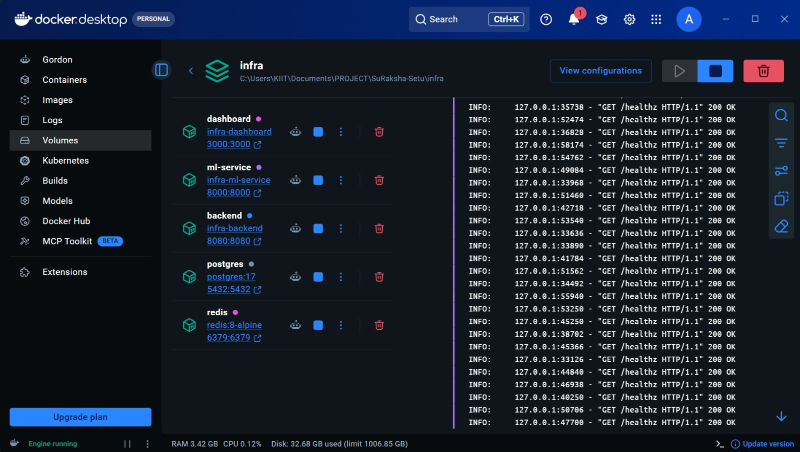
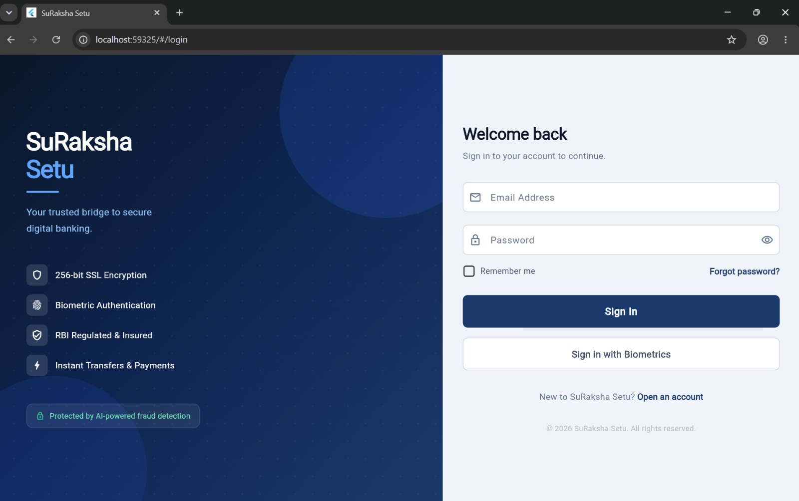
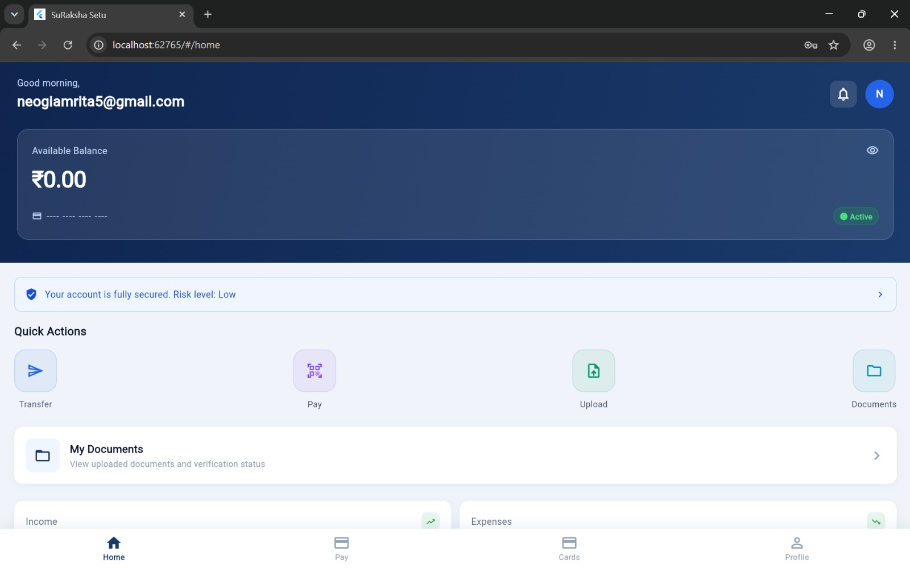
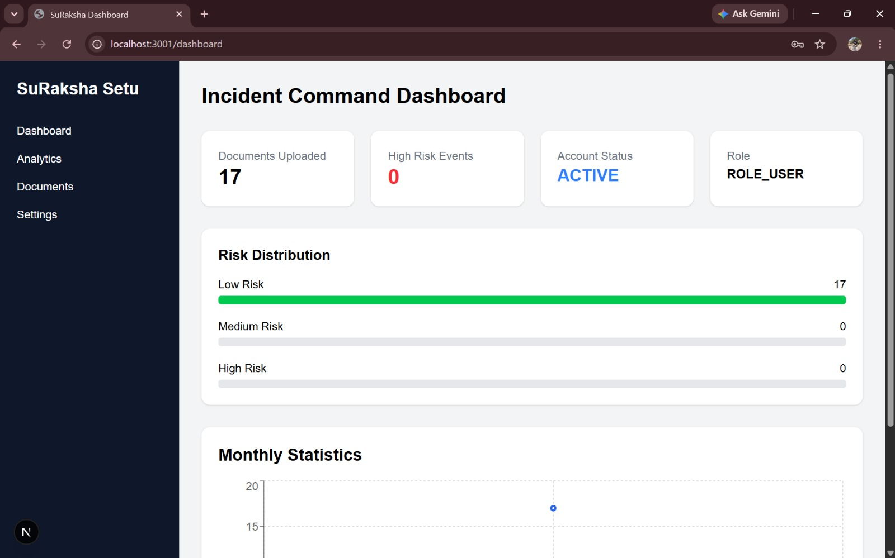

<div align="center">


# 🛡️ SuRaksha-Setu

### *सुरक्षा-सेतु — Bridging the Gap Between Banking and Cyber Security*

**A next-generation cybersecurity platform for real-time document fraud detection and agentic regulatory compliance in the Indian banking ecosystem.**

[](https://canarabank.hackerearth.com/)
[](https://www.hackerearth.com/)
[]()
[](LICENSE)

</div>

---

## 📌 Table of Contents

- [About the Hackathon](#-about-the-hackathon)
- [Problem Statement](#-problem-statement)
- [Our Solution](#-our-solution)
- [Key Features](#-key-features)
- [Architecture](#-architecture)
- [Tech Stack](#-tech-stack)
- [Getting Started](#-getting-started)
- [Project Structure](#-project-structure)
- [Screenshots](#-screenshots)
- [Team](#-team)

---

## 🏦 About the Hackathon

**SuRaksha Cyber Hackathon 2.0** is a national-level campus hackathon organized by **Canara Bank**, one of India's leading public sector banks, hosted on HackerEarth. The hackathon challenges undergraduate teams to build innovative cybersecurity solutions for the fintech domain.

| Detail | Info |
|--------|------|
| 🏆 Prize Pool | ₹11,00,000 (11 Lakhs) |
| 🎯 Focus Area | Cybersecurity in Fintech & Digital Banking |
| 👥 Team Size | 3–5 Members |
| 🗓️ Prototype Phase | June 1 – June 30, 2026 |
| 🌐 Platform | HackerEarth |

---

## ❗ Problem Statement

> *In an era of rapid banking digitization, traditional security and manual compliance processes are proving insufficient to address the scale and sophistication of modern threats.*

SuRaksha-Setu addresses **two critical problem areas** identified by Canara Bank:

### 1. 🔍 Real-Time Anomaly Detection in Financial Documents
Banks process thousands of documents daily — loan applications, land records, income certificates, and financial statements. Manual verification is slow, error-prone, and easily defeated by sophisticated forgeries. The need is for an **automated, real-time system** to detect tampering or forgery in these documents at scale.

### 2. 🤖 Agentic Regulatory Intelligence & Compliance
The Indian banking sector operates under a constantly evolving regulatory landscape (RBI circulars, SEBI guidelines, PMLA amendments, etc.). Tracking these changes and validating departmental compliance manually is a massive operational burden. The need is for an **AI agent** that autonomously monitors, interprets, and validates regulatory changes.

---

## 💡 Our Solution

**SuRaksha-Setu** (Security Bridge) is a unified platform that combines:

- A **Document Intelligence Engine** powered by computer vision and ML to detect forgery, tampering, and inconsistencies in financial documents in real time.
- An **Agentic Compliance Copilot** that autonomously crawls regulatory sources, extracts actionable directives, and verifies departmental compliance status — all without human intervention.

Together, these modules act as a *bridge* (Setu) between raw data and trustworthy, secure banking operations.

---

## ✨ Key Features

### 📄 Document Fraud Detection
- **Real-time tamper detection** — Identifies pixel-level manipulations, font inconsistencies, and metadata anomalies in uploaded documents
- **Multi-document support** — Handles land records, income proofs, bank statements, and financial certificates
- **Confidence scoring** — Each document receives an authenticity score with an explainable risk breakdown
- **Alert & escalation pipeline** — Flags suspicious documents with automated escalation to verification officers

### 🤖 Agentic Regulatory Compliance
- **Autonomous regulatory monitoring** — Continuously tracks RBI, SEBI, MCA, and PMLA regulatory updates
- **Semantic change parsing** — Uses NLP to extract actionable compliance tasks from dense regulatory text
- **Departmental validation** — Checks if each bank department has completed the required compliance actions
- **Audit trail generation** — Maintains a timestamped log of regulatory changes and compliance status

### 🔐 Security & Privacy
- All document analysis happens **on-premise** — sensitive data never leaves the bank's infrastructure
- Role-based access control (RBAC) for compliance dashboards
- End-to-end encryption for all document pipelines

---

## 🏗️ Architecture

```
┌─────────────────────────────────────────────────────────────┐
│                        SuRaksha-Setu                        │
│                                                             │
│  ┌──────────────┐          ┌───────────────────────────┐   │
│  │   Document   │          │   Regulatory Compliance   │   │
│  │  Upload API  │          │        Agentic Engine     │   │
│  └──────┬───────┘          └──────────────┬────────────┘   │
│         │                                 │                 │
│  ┌──────▼───────┐          ┌──────────────▼────────────┐   │
│  │  Preprocessing│          │  Regulatory Source Crawler│   │
│  │  & OCR Layer │          │  (RBI / SEBI / MCA feeds) │   │
│  └──────┬───────┘          └──────────────┬────────────┘   │
│         │                                 │                 │
│  ┌──────▼───────┐          ┌──────────────▼────────────┐   │
│  │  ML Anomaly  │          │   NLP Directive Extractor │   │
│  │  Detection   │          │   & Action Item Generator │   │
│  └──────┬───────┘          └──────────────┬────────────┘   │
│         │                                 │                 │
│  ┌──────▼───────┐          ┌──────────────▼────────────┐   │
│  │  Risk Score  │          │  Compliance Validator &   │   │
│  │  & Alert     │          │  Audit Trail Logger       │   │
│  └──────┬───────┘          └──────────────┬────────────┘   │
│         └──────────────┬──────────────────┘                │
│                        │                                    │
│               ┌────────▼────────┐                          │
│               │  Unified Dashboard (React Frontend)        │
│               └─────────────────┘                          │
└─────────────────────────────────────────────────────────────┘
```

---

## 🛠️ Tech Stack

| Layer | Technology |
|---|---|
| **Frontend Dashboard** | Next.js 16, TypeScript, Tailwind CSS, Recharts |
| **Backend API** | Spring Boot (Java 21), Maven |
| **AI/ML Service** | FastAPI (Python 3.11) |
| **Document Forensics** | OpenCV, NumPy, ELA & FFT Analysis |
| **ML / AI Models** | Scikit-learn, Joblib |
| **Database** | PostgreSQL 17 |
| **Cache & Session Store** | Redis 8 |
| **Authentication & Security** | JWT, Role-Based Access Control (RBAC) |
| **API Documentation** | Swagger UI, OpenAPI 3 |
| **Containerisation** | Docker, Docker Compose |
| **CI/CD** | GitHub Actions |
| **Monitoring & Health Checks** | Spring Boot Actuator, Docker Healthchecks |
| **Testing** | Pytest, Integration Testing Suite |
| **Version Control** | Git, GitHub |
| **Infrastructure** | Docker Bridge Networking, Persistent Volumes |
| **Development Tools** | VS Code, Postman, Docker Desktop |

---

## 🚀 Getting Started

### Prerequisites

Ensure the following are installed:

| Tool | Version |
|---|---|
| Docker Desktop | Latest |
| Docker Compose | Latest |
| Git | Latest |
| Java | 21+ *(for local backend development)* |
| Node.js | 20+ *(for local dashboard development)* |
| Python | 3.11+ *(for ML service development)* |

### 1. Clone the Repository

```bash
git clone https://github.com/Dev6158/SuRaksha-Setu.git
cd SuRaksha-Setu
```

### 2. Configure Environment

Create `infra/.env` (see `infra/.env.example`):

```env
POSTGRES_DB=suraksha
POSTGRES_USER=postgres
POSTGRES_PASSWORD=change_me

SPRING_PORT=8080
FASTAPI_PORT=8000
NEXT_PORT=3000
```

### 3. Run with Docker *(Recommended)*

```bash
# Build and start all services
docker compose -f infra/docker-compose.yml up -d --build

# Verify all containers are healthy
docker compose -f infra/docker-compose.yml ps
```

### 4. Access Services

| Service | URL |
|---|---|
| 🖥️ Admin Dashboard | http://localhost:3000 |
| ⚙️ Backend API | http://localhost:8080 |
| 📖 Swagger UI | http://localhost:8080/swagger-ui/index.html |
| 🤖 ML Service Health | http://localhost:8000/healthz |

### 5. Run Integration Tests

```bash
py -m pytest integration-tests -v
```

Expected result: **14 passed** ✅

---

## 📁 Project Structure

```
SuRaksha-Setu/
│
├── .github/
│   └── workflows/
│       └── deploy.yml
│
├── admin-dashboard/                   # Next.js frontend dashboard
│   ├── src/
│   │   ├── app/
│   │   │   └── dashboard/
│   │   ├── components/
│   │   │   ├── Sidebar.tsx
│   │   │   ├── RiskDistributionChart.tsx
│   │   │   └── RiskTrendChart.tsx
│   │   ├── hooks/
│   │   │   └── useDashboardData.ts
│   │   └── lib/
│   │       └── api.ts
│   ├── Dockerfile
│   ├── .dockerignore
│   ├── package.json
│   └── next.config.ts
│
├── android/
├── ios/
├── linux/
├── macos/
│
├── docs/                              # Project documentation
│   ├── AI_API_CONTRACT.md
│   ├── API_CONTRACTS.md
│   ├── DEPLOYMENT.md
│   ├── DEPLOYMENT_PLAN.md
│   ├── INTEGRATION_REPORT.md
│   └── TODO.md
│
├── infra/                             # Infrastructure & Docker config
│   ├── .env.example
│   ├── docker-compose.yml
│   ├── prometheus.yml
│   └── setup_secrets.sh
│
├── integration-tests/                 # Pytest integration suite
│   ├── test_ai.py
│   ├── test_auth.py
│   ├── test_dashboard.py
│   ├── test_system_integration.py
│   └── test_upload.py
│
├── ml-service/                        # FastAPI ML service (AI/ML layer)
│   ├── app.py
│   ├── Dockerfile.forensic
│   ├── Dockerfile.behavioral
│   ├── docker-compose.ml.yml
│   └── requirements.txt
│
├── src/                               # Spring Boot backend
│   ├── main/
│   │   ├── java/com/suraksha/Setu/
│   │   │   ├── Config/
│   │   │   ├── Controller/
│   │   │   ├── dto/
│   │   │   ├── Entity/
│   │   │   ├── exception/
│   │   │   ├── Repo/
│   │   │   ├── Security/
│   │   │   ├── Service/
│   │   │   ├── Websocket/
│   │   │   └── DemoApplication.java
│   │   └── resources/
│   └── test/
│       └── java/com/suraksha/Setu/
│
├── app.py                             # Root-level ML entrypoints
├── forensic_engine.py
├── behavioral_analytics_engine.py
├── cross_document_graph.py
├── generate_training_data.py
├── train_and_persist.py
├── schemas.py
├── utils.py
│
├── Dockerfile
├── Makefile
├── pom.xml
├── openapi_spec.yaml
├── requirements.txt
├── README.md
├── mvnw
└── mvnw.cmd
```

---

## 📸 Screenshots

> All services running — captured live from the prototype deployment.

**Docker Desktop — All Containers Healthy**


*dashboard · ml-service · backend · postgres · redis — all green*

---

**Mobile App — Login Screen** *(Flutter)*


*"Your trusted bridge to secure digital banking." — SuRaksha Setu mobile client*

---

**Mobile App — Home Dashboard** *(Flutter)*


*Live balance card, risk level indicator, quick actions (Transfer · Pay · Upload · Documents)*

---

**Admin Dashboard — Incident Command** *(Next.js)*


*Risk distribution breakdown (Low / Medium / High), document upload stats, and monthly statistics chart*

---

## 👥 Team

| Name | Role |
|------|------|
| Procheta | UI/UX & Frontend Development |
| Oishika | Backend Engineering |
| Amrita | DevOps & Integration |
| Shreya | AI/ML Engineering |
| **Debansh** | **Team Lead · Architecture Design · AI/ML Engineering** |

---

## 📊 Evaluation Alignment

| Criterion | Our Approach |
|-----------|-------------|
| **Relevance to Theme** | Directly addresses both problem statements issued by Canara Bank |
| **Innovation & Uniqueness** | Combines agentic AI with real-time document forensics in a single platform |
| **Feasibility** | Modular architecture — each component can be deployed independently |
| **Impact** | Targets fraud prevention and compliance automation for a bank serving crores of customers |
| **Technical Execution** | ML + NLP + OCR pipeline with a production-ready REST API and dashboard |
| **Real-World Scalability** | Containerized deployment, horizontally scalable, on-premise data residency |

---

## 📄 License

This project is licensed under the [MIT License](LICENSE).

---

<div align="center">

Built with ❤️ for **Canara Bank SuRaksha Cyber Hackathon 2.0**

*सुरक्षित भारत, डिजिटल भारत — Secure India, Digital India*

</div>
