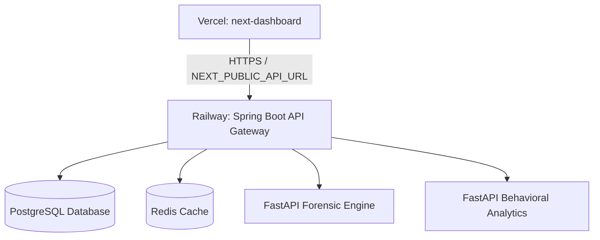

# 🛡️ SuRaksha-Setu: Split Production Deployment Guide
This guide details how to execute a **split-platform deployment** for the **SuRaksha-Setu** banking threat protection platform:
* **Frontend Dashboard (Next.js)** -> Hosted on **Vercel** (Global Edge CDN, serverless routing)
* **API Gateway & Core Databases (Spring Boot, FastAPI Forensic/Behavioral, PostgreSQL, Redis)** -> Hosted on **Railway** (Docker Compose orchestration, managed persistence)

---

## 🏗️ Architecture Overview



---

## 🛠️ Step 1: Deploy Backend & Databases on Railway

### 1. Push your Code to GitHub
Ensure all your local changes (specifically on the `dev` branch) are committed and pushed to your private or public GitHub repository.

### 2. Import into Railway
1. Log in to [Railway](https://railway.app) via GitHub.
2. Click **New Project** → **Deploy from GitHub repo**.
3. Select your `SuRaksha-Setu` repository and choose the `dev` branch.
4. Railway will scan the repository and detect the `deploy-online/docker-compose.yml` configuration automatically.

### 3. Configure Variables in Railway
Go to the **Variables** tab for the `backend` and `postgres` service cards in Railway and configure the variables matching `deploy-online/.env.example`:
* `POSTGRES_DB`: `suraksha`
* `POSTGRES_USER`: `postgres`
* `POSTGRES_PASSWORD`: `use_a_secure_custom_password`
* `JWT_SECRET`: `generate_a_long_random_jwt_secret_key`
* `SPRING_PORT`: `8080`
* `FASTAPI_PORT`: `8000`
* `NEXT_PORT`: `3000` (ignored on Vercel, but kept for docker environment completeness)

### 4. Expose the Spring Boot API Gateway
We need to generate a public domain URL for the backend so Vercel can communicate with it:
1. Click on the **`backend`** service card in Railway.
2. Go to **Settings** → **Public Networking**.
3. Click **Generate Domain**.
4. Copy the generated URL (e.g. `https://suraksha-backend-production.up.railway.app`). This is your **`BACKEND_API_URL`**.

---

## ⚡ Step 2: Deploy Frontend Dashboard on Vercel

### 1. Import Project into Vercel
1. Log in to [Vercel](https://vercel.com) using your GitHub account.
2. Click **Add New** → **Project**.
3. Find your `SuRaksha-Setu` repository and click **Import**.

### 2. Edit Project Root Directory
Vercel needs to know the dashboard is inside a subfolder:
1. Next to **Root Directory**, click **Edit**.
2. Select **`deploy-online/admin-dashboard`** and click **OK**.

### 3. Configure Build Settings
* **Framework Preset:** Select **Next.js** (it will auto-detect this).
* **Build Command:** `npm run build`
* **Output Directory:** `.next`
* **Install Command:** `npm install`

### 4. Add Environment Variables
Expand the **Environment Variables** section and add:
* **Key:** `NEXT_PUBLIC_API_URL`
* **Value:** `https://suraksha-backend-production.up.railway.app` *(use the exact URL copied from Railway in Step 1)*

### 5. Click Deploy
Vercel will compile the Next.js static and serverless routes, fetch assets, and expose your dashboard globally.

---

## 🩺 Verifying the Deployment

1. **Check Backend Status:** Open `https://your-backend-url.up.railway.app/actuator/health` in your browser. It should return:
   ```json
   {"status":"UP"}
   ```
2. **Access Dashboard:** Open your generated Vercel URL (e.g., `https://suraksha-dashboard.vercel.app`).
3. **Run Forensic Scans:** Navigate to the **Upload Asset** tab on your Vercel Dashboard, select [20250404112835_Aadhaar-card-generated-using-AI.avif](file:///home/debanshhota/SuRaksha-Setu/20250404112835_Aadhaar-card-generated-using-AI.avif) or [Sample_aadhar.json](file:///home/debanshhota/SuRaksha-Setu/Sample_aadhar.json), and verify that scans are evaluated as `HIGH_RISK` and displayed instantly on the GUI.
